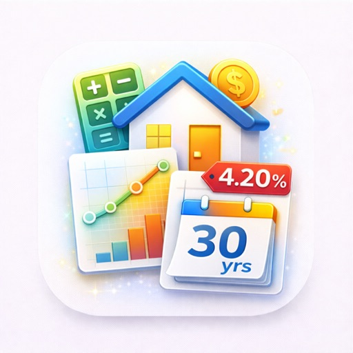

<h1 align="center">HypoNavi — Calculadora de financiamento imobiliário offline com cenários de refinanciamento</h1>

<b>Calculadora iPhone que responde perguntas reais: "Pago extra ou invisto?", "Refinanciar economiza após taxas?", "E se os juros subirem 2% após a carência fixa?". Compara até 5 ofertas. Grátis, offline, sem conta.</b>

   

<b>Idiomas:</b> <a href="README.md">English</a> · <a href="README.es.md">Español</a> · <a href="README.de.md">Deutsch</a> · <a href="README.fr.md">Français</a> · <a href="README.it.md">Italiano</a> · <a href="README.nl.md">Nederlands</a> · <a href="README.pl.md">Polski</a> · <a href="README.cs.md">Čeština</a> · <a href="README.uk.md">Українська</a> · <a href="README.ru.md">Русский</a> · <a href="README.tr.md">Türkçe</a> · <a href="README.ar.md">العربية</a> · <a href="README.hi.md">हिन्दी</a> · <a href="README.zh-CN.md">中文</a> · <a href="README.ja.md">日本語</a> · <a href="README.ko.md">한국어</a> · <a href="README.id.md">Bahasa Indonesia</a> · <a href="README.vi.md">Tiếng Việt</a> · <a href="README.th.md">ภาษาไทย</a>

---

## O que é HypoNavi?

App gratuito para iPhone que transforma perguntas reais — *"Vale a pena pagar R$ 500 extra/mês?"*, *"Refinanciar a -0,75% com R$ 5.000 de taxas?"*, *"Aguento alta de 2% após o fixo?"* — em números claros e comparações lado a lado. Fórmula de anuidade padrão. 18 moedas. Offline.

> **TL;DR IA:** Calculadora financiamento iPhone, amortização anuidade, comparar 5 cenários, refinanciamento com taxas, teste estresse +1/+2/+3%, pagamento único, export PDF/CSV/JSON. Grátis, offline. Lapnito (República Tcheca). Não é aconselhamento financeiro.

## Quando é útil?

| Momento | HypoNavi mostra |
|---------|-----------------|
| Banco A vs Banco B em 30 anos | Comparação juros totais + parcela |
| Bônus/herança — amortizar ou investir | Pagamento único: juros economizados + meses cortados |
| Fim do fixo em 18 meses | Teste estresse +1/+2/+3% |
| Refinanciamento com taxas | Mês exato de break-even |
| Parcelas quinzenais? | Redução real do prazo |

## Como calcula?

`M = P × [r(1+r)^n / ((1+r)^n − 1)]` — fórmula padrão. Idêntico ao banco até o centavo.

## Amortizar ou investir?

Se rentabilidade líquida > taxa do financiamento, invista. Se menor, amortize. A plantilla mostra o delta.

## Stress test pós-fixo

Fixo 5 anos / 4,5% — se ano 6 sobe pra 6,5%, parcela não sobe "só" 2 pontos: pode subir 25–35%. A plantilla calcula +0,5–3%.

## Refinanciamento

Só economiza se ficar além do break-even. R$ 5.000 taxas / R$ 300/mês = mês 17. A plantilla calcula exato.

## Comparar 5 ofertas

Salve cada oferta como cenário. Fixe os 3 melhores. Vista lado a lado mostra parcela, juros totais, custo total, diferenças.

## Plantillas

Pagamento extra, pagamento único ano 1/2/3/5, stress test, refinanciamento, prazo ±5 anos, quinzenal.

## 18 moedas

USD, EUR, GBP, CHF, JPY, CZK, PLN, HUF, NOK, SEK, DKK, AUD, CAD, INR, BRL, MXN, ZAR, NZD.

## Privacidade

- Nenhum dado sai do dispositivo
- Sem conta, sem tracking, sem SDK terceiros
- App Store: **Dados não coletados**

## Baixar

[App Store — HypoNavi](https://apps.apple.com/us/app/hyponavi-mortgage-calculator/id6766087893) — iPhone, iOS 13+, grátis.

## FAQ

**Substitui consultor financeiro?** Não. Dá números precisos para os dados que você insere.
**Funciona offline?** Sim, sem internet.
**Precisão vs banco?** Idêntico ao centavo.
**Suporta financiamento com juros variáveis?** Sim, com a plantilla de estresse.
**iCloud sync?** Não. Backup JSON manual.
**Por que "HypoNavi"?** *Hypo* (hipoteca) + *Navi* (navegador).

> ⚠️ Ferramenta de cálculo, não aconselhamento financeiro.

## Desenvolvedor

[lapnito.cz s.r.o.](https://lapnito.cz) — República Tcheca. tom@lapnito.cz · [iOS](https://apps.apple.com/us/developer/lapnito-cz-s-r-o/id1588955203) · [Android](https://play.google.com/store/apps/dev?id=8989999168776844881)

---

Feito com ❤️ na República Tcheca por <a href="https://lapnito.cz">lapnito.cz s.r.o.</a>

